# Cairo

Nim Cairo wrapper, solving your vector and text drawing needs.


## example: tests/arc.nim
```nim

var
  xc = 128.0
  yc = 128.0
  radius = 100.0
  angle1 = 45.0  * PI / 180.0  # angles are specified
  angle2 = 180.0 * PI / 180.0  # in radians

ctx.setLineWidth(10.0)
ctx.arc(xc, yc, radius, angle1, angle2)
ctx.stroke()

# draw helping lines
ctx.setSourceRGBA(1.0, 0.2, 0.2, 0.6)
ctx.setLineWidth(6.0)

ctx.arc(xc, yc, 10.0, 0, 2*PI)
ctx.fill()

ctx.arc(xc, yc, radius, angle1, angle1)
ctx.lineTo(xc, yc)
ctx.arc(xc, yc, radius, angle2, angle2)
ctx.lineTo(xc, yc)
ctx.stroke()

```
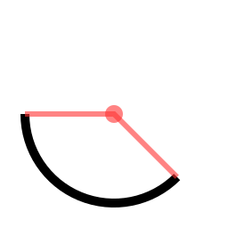

## example: tests/clip.nim
```nim

ctx.arc(128.0, 128.0, 76.8, 0, 2 * PI)
ctx.clip()

ctx.newPath()  # current path is not consumed by ctx.clip()
ctx.rectangle(0, 0, 256, 256)
ctx.fill()
ctx.setSourceRGB(0, 1, 0)
ctx.moveTo(0, 0)
ctx.lineTo(256, 256)
ctx.moveTo(256, 0)
ctx.lineTo(0, 256)
ctx.setLineWidth(10.0)
ctx.stroke()

```
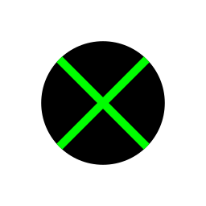

## example: tests/clip_image.nim
```nim

ctx.arc(128.0, 128.0, 76.8, 0, 2*PI)
ctx.clip()
ctx.newPath() # path not consumed by clip()

var
  image = imageSurfaceCreateFromPng("tests/data/romedalen.png")
  w = float image.getWidth()
  h = float image.getHeight()

ctx.scale(256.0 / w, 256.0 / h)

ctx.setSource(image, 0, 0)
ctx.paint()

ctx.stroke()

```
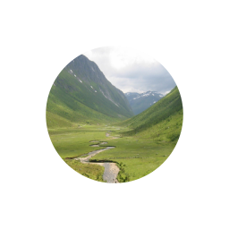

## example: tests/curve_to.nim
```nim

var
  x=25.6
  y=128.0
  x1=102.4
  y1=230.4
  x2=153.6
  y2=25.6
  x3=230.4
  y3=128.0

ctx.moveTo(x, y)
ctx.curveTo(x1, y1, x2, y2, x3, y3)

ctx.setLineWidth( 10.0)
ctx.stroke()

ctx.setSourceRGBA(1, 0.2, 0.2, 0.6)
ctx.setLineWidth(6.0)
ctx.moveTo(x, y)
ctx.lineTo(x1, y1)
ctx.moveTo(x2, y2)
ctx.lineTo(x3, y3)
ctx.stroke()

```
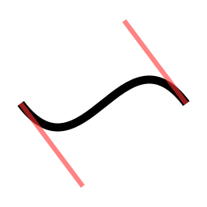

## example: tests/dash.nim
```nim

var
  dashes = @[
    50.0,  # ink
    10.0,  # skip
    10.0,  # ink
    10.0   # skip
  ]
  offset = -50.0

ctx.setDash(dashes, offset)
ctx.setLineWidth(10.0)

ctx.moveTo(128.0, 25.6)
ctx.lineTo(230.4, 230.4)
ctx.relLineTo(-102.4, 0.0)
ctx.curveTo(51.2, 230.4, 51.2, 128.0, 128.0, 128.0)

ctx.stroke()

```


## example: tests/fill_and_stroke.nim
```nim

ctx.moveTo(128.0, 25.6)
ctx.lineTo(230.4, 230.4)
ctx.relLineTo(-102.4, 0.0)
ctx.curveTo(51.2, 230.4, 51.2, 128.0, 128.0, 128.0)
ctx.closePath()

ctx.moveTo(64.0, 25.6)
ctx.relLineTo(51.2, 51.2)
ctx.relLineTo(-51.2, 51.2)
ctx.relLineTo(-51.2, -51.2)
ctx.closePath()

ctx.setLineWidth(10.0)
ctx.setSourceRGB(0, 0, 1)
ctx.fillPreserve()
ctx.setSourceRGB(0, 0, 0)
ctx.stroke()

```
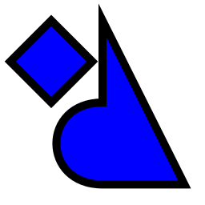

## example: tests/gradient.nim
```nim

var linerGradient = patternCreateLinear(0.0, 0.0,  0.0, 256.0)
linerGradient.addColorStopRgba(1, 0, 0, 0, 1)
linerGradient.addColorStopRgba(0, 1, 1, 1, 1)
ctx.rectangle(0, 0, 256, 256)
ctx.setSource(linerGradient)
ctx.fill()

var radialGradient  = patternCreateRadial(115.2, 102.4, 25.6, 102.4,  102.4, 128.0)
radialGradient.addColorStopRgba(0, 1, 1, 1, 1)
radialGradient.addColorStopRgba(1, 0, 0, 0, 1)
ctx.setSource(radialGradient)
ctx.arc(128.0, 128.0, 76.8, 0, 2 * PI)
ctx.fill()

```
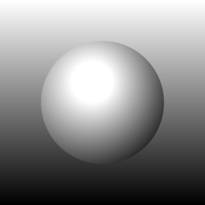

## example: tests/image.nim
```nim

var
  image = imageSurfaceCreateFromPng("tests/data/romedalen.png")
  w = float image.getWidth()
  h = float image.getHeight()

ctx.translate(128.0, 128.0)
ctx.rotate(45 * PI/180)
ctx.scale(256.0 / w, 256.0 / h)
ctx.translate(-0.5 * w, -0.5 * h)

ctx.setSource(image, 0, 0)
ctx.paint()

ctx.stroke()

```
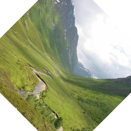

## example: tests/image_pattern.nim
```nim

var
  image = imageSurfaceCreateFromPng("tests/data/romedalen.png")
  w = float image.getWidth()
  h = float image.getHeight()

var pattern = patternCreateForSurface(image)
pattern.setExtend(EXTEND_REPEAT)

ctx.translate(128.0, 128.0)
ctx.rotate(PI / 4)
ctx.scale(1.0 / sqrt(2.0), 1.0 / sqrt(2.0))
ctx.translate(-128.0, -128.0)

var matrix: TMatrix
initScale(addr matrix, w/256.0 * 5.0, h/256.0 * 5.0)
pattern.setMatrix(addr matrix)

ctx.setSource(pattern)

ctx.rectangle(0, 0, 256.0, 256.0)
ctx.fill()

```
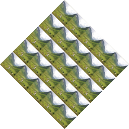

## example: tests/line_cap.nim
```nim

ctx.setLineWidth(30.0)
ctx.setLineCap(LINE_CAP_BUTT) # default
ctx.moveTo(64.0, 50.0)
ctx.lineTo(64.0, 200.0)
ctx.stroke()
ctx.setLineCap(LINE_CAP_ROUND)
ctx.moveTo(128.0, 50.0)
ctx.lineTo(128.0, 200.0)
ctx.stroke()
ctx.setLineCap(LINE_CAP_SQUARE)
ctx.moveTo(192.0, 50.0)
ctx.lineTo(192.0, 200.0)
ctx.stroke()

# draw helping lines
ctx.setSourceRGB(1.0, 0.2, 0.2)
ctx.setLineWidth(2.56)
ctx.moveTo(64.0, 50.0)
ctx.lineTo(64.0, 200.0)
ctx.moveTo(128.0, 50.0)
ctx.lineTo(128.0, 200.0)
ctx.moveTo(192.0, 50.0)
ctx.lineTo(192.0, 200.0)
ctx.stroke()

```
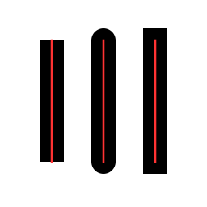

## example: tests/line_join.nim
```nim

ctx.setLineWidth(40.96)
ctx.moveTo(76.8, 84.48)
ctx.relLineTo(51.2, -51.2)
ctx.relLineTo(51.2, 51.2)
ctx.setLineJoin(LINE_JOIN_MITER) # default
ctx.stroke()

ctx.moveTo(76.8, 161.28)
ctx.relLineTo(51.2, -51.2)
ctx.relLineTo(51.2, 51.2)
ctx.setLineJoin(LINE_JOIN_BEVEL)
ctx.stroke()

ctx.moveTo(76.8, 238.08)
ctx.relLineTo(51.2, -51.2)
ctx.relLineTo(51.2, 51.2)
ctx.setLineJoin(LINE_JOIN_ROUND)
ctx.stroke()

```


## example: tests/rounded_rectangle.nim
```nim

# a custom shape that could be wrapped in a function
var
  x         = 25.6        # parameters like ctx.rectangle
  y         = 25.6
  width         = 204.8
  height        = 204.8
  aspect        = 1.0     # aspect ratio
  cornerRadius = height / 10.0   # and corner curvature radius
  radius = cornerRadius / aspect
  degrees = PI / 180.0

ctx.newSubPath()
ctx.arc(x + width - radius, y + radius, radius, -90 * degrees, 0 * degrees)
ctx.arc(x + width - radius, y + height - radius, radius, 0 * degrees, 90 * degrees)
ctx.arc(x + radius, y + height - radius, radius, 90 * degrees, 180 * degrees)
ctx.arc(x + radius, y + radius, radius, 180 * degrees, 270 * degrees)
ctx.closePath()

ctx.setSourceRGB(0.5, 0.5, 1)
ctx.fillPreserve()
ctx.setSourceRGBA(0.5, 0, 0, 0.5)
ctx.setLineWidth(10.0)
ctx.stroke()

```


## example: tests/text.nim
```nim

ctx.selectFontFace("Sans", FONT_SLANT_NORMAL, FONT_WEIGHT_NORMAL)
ctx.setFontSize(90.0)

ctx.moveTo(10.0, 135.0)
ctx.showText("Hello")

ctx.moveTo(70.0, 165.0)
ctx.textPath("void")
ctx.setSourceRGB(0.5, 0.5, 1)
ctx.fillPreserve()
ctx.setSourceRGB(0, 0, 0)
ctx.setLineWidth(2.56)
ctx.stroke()

# draw helping lines
ctx.setSourceRGBA(1, 0.2, 0.2, 0.6)
ctx.arc(10.0, 135.0, 5.12, 0, 2*PI)
ctx.closePath()
ctx.arc(70.0, 165.0, 5.12, 0, 2*PI)
ctx.fill()


```
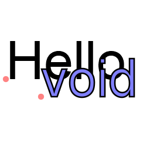

## example: tests/text_align.nim
```nim

ctx.selectFontFace("Sans", FONT_SLANT_NORMAL, FONT_WEIGHT_NORMAL)
ctx.setFontSize(52.0)

var
  text = "cairo"
  extents: TTextExtents
ctx.textExtents(text, addr extents)

var
  x = 128.0 - (extents.width / 2 + extents.xBearing)
  y = 128.0 - (extents.height / 2 + extents.yBearing)

ctx.moveTo(x, y)
ctx.showText(text)

# draw helping lines
ctx.setSourceRGBA(1, 0.2, 0.2, 0.6)
ctx.setLineWidth(6.0)
ctx.arc(x, y, 10.0, 0, 2*PI)
ctx.fill()
ctx.moveTo(128.0, 0)
ctx.relLineTo(0, 256)
ctx.moveTo(0, 128.0)
ctx.relLineTo(256, 0)
ctx.stroke()

```
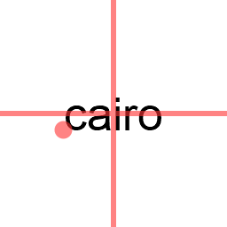


# Realtime


You can also use cairo for real time graphics using. Here are examples on how to use cairo with:
  * [SDL2](tests/realtime_sdl2.nim)
  * [GLUT](tests/realtime_glut.nim)
  * [GLFW](tests/realtime_glfw.nim)


